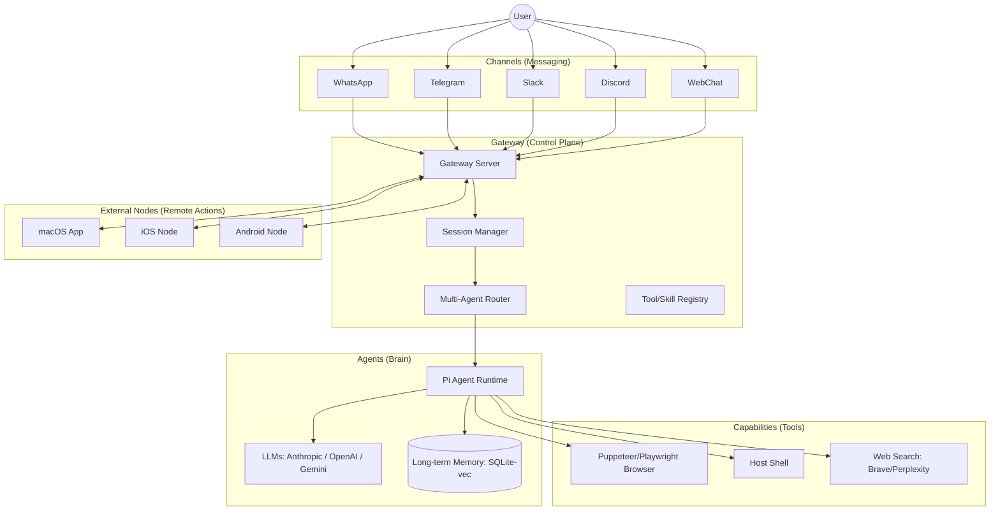

# OpenClaw Architecture

OpenClaw is a personal AI assistant system designed to be run locally or on a private server. It follows a modular, gateway-centric architecture.

## System Overview

## Key Components

### 1. Gateway (Control Plane)

The Gateway is the central Node.js server. It manages:

- **Connections**: WebSocket and HTTP connections from channels and nodes.
- **Sessions**: Maintaining state and history for different conversations.
- **Routing**: Directing messages from specific channels/peers to the right AI agents.
- **Web Interface**: Serving the Control UI and WebChat.

### 2. Pi Agent Runtime

The core orchestration layer for the AI. It handles:

- **LLM Communication**: Managing prompts, streaming, and tool calls.
- **Tool Execution**: Running local commands, controlling browsers, or fetching web content.
- **Memory Management**: Using `sqlite-vec` to store and retrieve relevant context from past interactions.

### 3. Channels

Adapters that connect the Gateway to various messaging platforms. Each channel handles its own authentication, message formatting, and media uploads/downloads.

- **Direct Connect**: WhatsApp (Baileys), Telegram (grammY), Discord (discord.js), Slack (Bolt).
- **Extension Connect**: Signal, iMessage, Microsoft Teams.

### 4. Nodes (Companion Apps)

OpenClaw can connect to "nodes" running on different devices.

- **Capability Advertisement**: Nodes tell the Gateway what they can do (e.g., "I have a camera", "I can run macOS commands").
- **Remote Invocations**: The Gateway can ask a node to perform an action and send back the results (images, audio, command output).

### 5. Skills & Plugins

- **Skills**: Self-contained sets of prompts and tools (`SKILL.md`) that can be added to an agent's workspace.
- **Plugins**: Deeper integrations that can extend the Gateway's core functionality.

## Data Flow

1.  **Inbound**: A message arrives from a Channel (e.g., Telegram).
2.  **Session Loop**: The Gateway identifies the session, loads history, and prepares the "envelope" (context).
3.  **Agent Logic**: The Pi Agent generates a response, potentially calling tools (e.g., searching the web or checking a local file).
4.  **Tool Execution**: Tools run on the host or inside a Docker sandbox. If a node-specific tool is called, the request is routed to the connected device node.
5.  **Outbound**: The final response (text, audio, or media) is streamed back through the originating Channel.

## Security Model

- **Pairing**: Unknown senders must be explicitly approved via a pairing code.
- **Sandboxing**: Non-main sessions (like group chats) can be forced to run tools inside Docker containers.
- **Local-First**: Sensitive data mostly stays on your own hardware. API keys are managed via environment variables or a local `openclaw.json` config.
